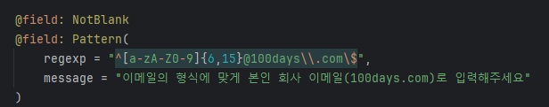
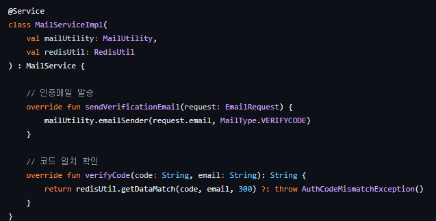
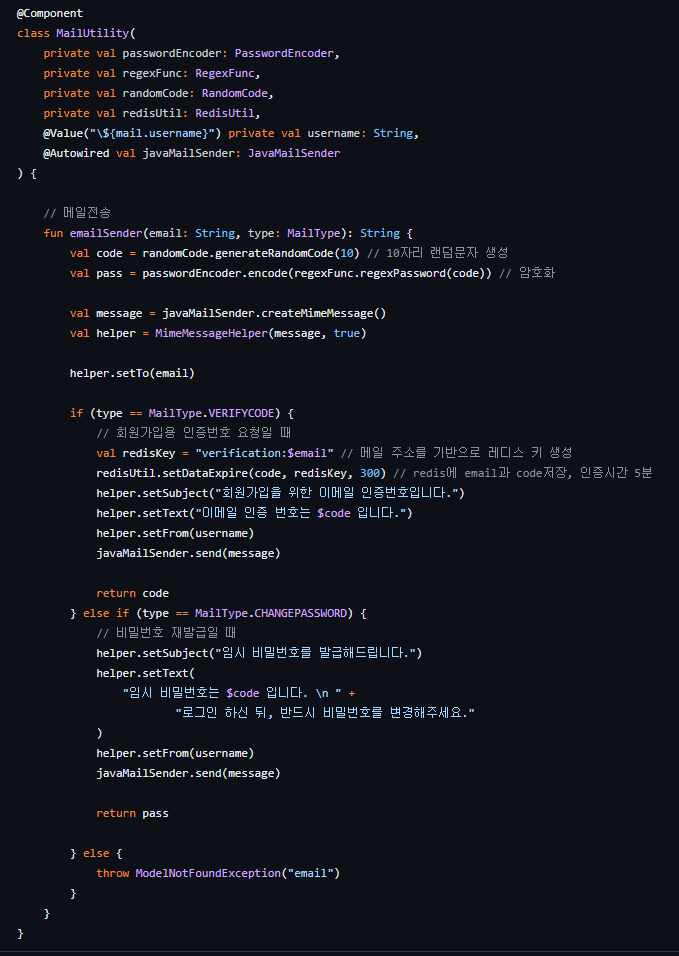
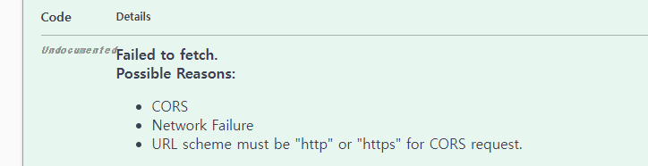
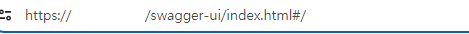
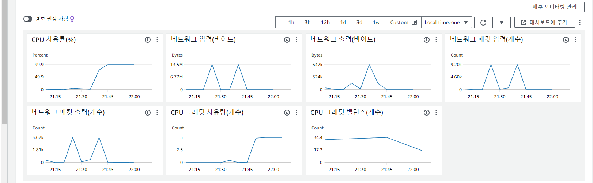
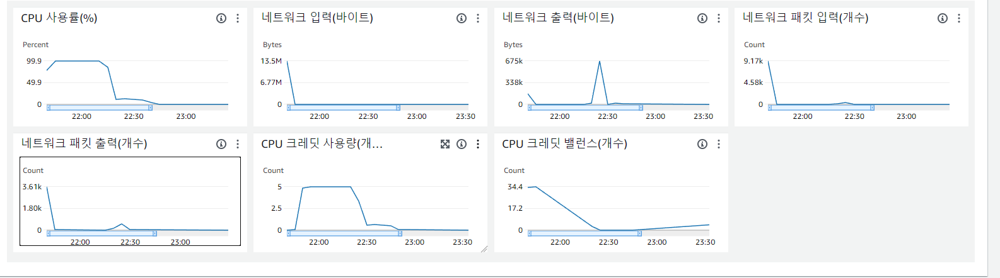
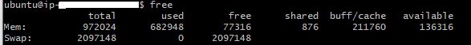
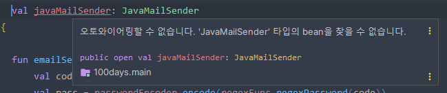
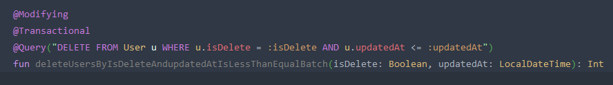

# 🕛작심 백일

## 👨‍🏫 프로젝트 소개

작심삼일이라는 사자성어와 습관을 만드는데 세 달이 걸린다는 속설에서 영감을 얻어
어떤 일이든 100일간 시도해 나의 일상으로 만드는 것을 목표로 하는 사이트입니다 !!

👥 소개
-------------
|                                                참여인원                                                 |
|:---------------------------------------------------------------------------------------------------:|
|  |
|                                                 최혜림                                                 |
|                                 [rim109](https://github.com/rim109)                                 |

-------------
### 프로젝트 계기

모두 이루고자 하는 목표를 위해 계획을 세웁니다.
그러나 동시에 많은 이들이 동기를 잃고 계획을 그만두게 됩니다.
바로 그 점에서 착안하여 작심백일이 만들어졌습니다.

“작심삼일” 이란 사자성어와
삼개월간 꾸준히 무언가를 하면 습관이 된다는 아이디어를 합쳐
이용자가 100일간 이루어나갈 자신의 목표를 정하고,
모두와 함께 달리며 동기를 유지하기 위해 만들어진 프로젝트입니다.

-------------
## ⏲️ 개발기간

### 2024.02.26(월) ~ 2024.04.05(금) 1차
### 2025.06.16(월) ~ 2차

📚️ 기술스택
-------------
### ✔️ Language

-------------
### ✔️ Version Control

-------------
### ✔️ IDE

-------------
### ✔️ Framework

-------------
### ✔️ DB  

-------------
### ✔️ 협업 TOOLS

-------------
### ✔️ Deploy

-------------
### ✔️와이어프레임

### ✔️API 명세서
[API 명세서](https://productive-sesame-df1.notion.site/909a6906c57945f1a70c0bda40b8451d?v=3bbf20a27af54f529688a43126f16fdb&pvs=4)
### ✔️ ERD

### ✔️ 서비스 구조

### ✔️ 기술적 의사결정

 어드민 테이블을 나눌지? 

      [도입] 
     -지금은 소수 사이트지만 나중에 규모가 커지게 되면 유지보수를 위해서라도 어드민과 유저의 컬럼을 분리하는 편이 낫지 않을까라는 의문에서 시작 
      [문제상황]
     -보통 ROLE로 역할을 나누었으나, 어드민과 유저 테이블을 나누지 않으면 유저들도 쉽게 어드민으로 회원가입과 로그인을 할 수 있는 상황이 발생할 위험 가능성 있음. 
      [해결방안]  
         - 처음부터 유저와 어드민의 DB를 분리하는 방향으로 결정함. 
           
         - 회사 이메일을 따로 생성해서 그 이메일로만 가입하도록 설정하기로 결정함. 
      [의견조율]
      -어드민과 유저 테이블을 나눌지, 합칠지에 대한 고민을 함.
     - 혹시라도 나누게 되면 어드민 로그인과 회원가입은 한 로직에서 할지 이 마저도 나눠서 할지에 대한 고민을 함.
     - 어드민의 회원가입인 경우, 특별한 차별점을 두어 일반 유저들은 가입을 못하도록 하는 방법을 모색함.  
      [결정] 
        - 유저와 어드민 테이블과 로그인, 회원가입 로직은 나누기로 하고 토큰 발행은 동일하게 설정함. 
        - 어드민 회원가입을 할 때 회사 이메일로 가입할 수 있도록 설정하여 유저가 접근할 수 없게 설정함. 
---------------------------------------------------------------------------------------------------------------------------------

 

 회원 탈퇴 & 밴을 어떤식으로 처리할까? 

      [도입] 
      * 회원 탈퇴
     - 바로 회원정보를 삭제할지, 아니면 데이터를 일정 기간 보존한 뒤 삭제할지에 관한 정책 고민. 
      * 밴 (유저 활동정지)
     - 활동정지 상태에서 권한을 어디까지 줄지, 또 정지는 수동으로 풀지 아니면 기한을 입력받아서 자동으로 풀어줄지에 대해서. 
      [문제상황]
      * 회원 탈퇴
     -회원정보를 바로 삭제할 경우, 개인정보 보호의 측면에서는 괜찮다고 생각함. 그러나 실수에 의한 선택의 경우 돌이킬 수 있는 유예기간이 존재하지 않음. 
      * 밴 (유저 활동정지)
     -처음은 밴 당한 유저는 읽기 전용으로만 만들 생각이었으나, 비회원 유저보다도 오히려 더 많은 권한을 주게 된다고 생각함. 
     -그리고 날짜를 지정하지 않고 운영자가 수동으로 해제하는 경우, 소규모일 경우에는 문제가 되지 않으나 이용자가 많아질 경우 매번 처리가 힘들어 번거로울수도 있다고 생각함.  
      [의견조율]
      * 회원 탈퇴
      -회원 데이터를 무조건적으로 남기고 보호하자니 이번엔 사이트 측에서 개인의 정보를 함부로 보관하게 되는 문제가 있었음. 또 데이터를 남기기만 하면 너무 많은 용량을 차지하게 됨. 
      * 밴 (유저 활동정지)
     - 사이트 전체 차단은 어떻냐는 의견도 있었으나, 접속자체를 불가능하게 막는것은 밴의 범위를 넘어선 것 같음.
     - 또 현재 사이트 규모를 생각하면 수동 밴 해제도 나쁘지 않다는 의견이 있었으나, 기한이 길어질 경우 처리를 잊거나 사람의 경우 정시에 정확하게 해제하기는 힘들다는 의견이 있음.  
      [해결방안]
          * 회원 탈퇴  
         1. status를 추가해 soft delete로 구현하기로 했음.  
         2. 최종 업데이트 시간을 기준으로 탈퇴 상태의 회원정보를 7일간 보관한 후, 자정에 일괄 삭제하기로 함.  
           * 밴 (유저 활동정지)    
        1. 차단 범위는 로그인 시 밴 유저임을 알리고 접속을 막음.  
        2. 날짜를 입력하여 기한이 되면 자동으로 밴이 해제됨. 
      [기타] 
    -두 기능 모두 Scheduled 를 이용하여 구현함. 정해진 기간에 특정 데이터를 처리해야 하기에 사용하기에 적절하다고 판단 
    - soft delete를 적용한 목적에 따라, 7일이 지나기 전에 회원이 다시 로그인 할 경우 탈퇴 상태 > 일반 상태로 돌아오고 삭제 예정상태도 false 가 되도록 설정함. 
---------------------------------------------------------------------------------------------------------------------------------

 

 Redis의 사용 이유? 

      [도입]
      * Redis를 사용한 이유는?
     -Redis를 사용한 이유는 빠른 응답시간과 확장성을 제공하기 위함. 메모리에 데이터를 저장하므로 요청의 처리 속도가 빠르고, 다양한 자료형을 지원하는 특징을 가지고 있음.  
      [문제상황]
      * 서비스에서 DB의 접근이 너무 많은 API 발생 
     -웹 서비스는 기본적으로 DB에 접근을 많이 할 수록 응답속도와 사용경험에 악영향을 끼침. 따라서 캐싱의 필요성을 느꼈고, 대표적으로 사용되는 검색 결과 캐싱 외에 토큰이나 검색어같은 여러 케이스가 있었음. 
      [의견조율] 
      * 캐싱 시스템 도입, 어떤 라이브러리를 사용할까?  
         캐시를 관리하는 라이브러리를 선택할 때 고려해야 할 점은 쉬운 인터페이스 구조, 빠른 응답, 다양한 데이터타입 지원. 이에 Redis를 선택하기로 결정 
  [결정]
  * Redis를 이용한 캐싱 구현  
- 각각 맡은 파트 별로 캐싱 기능이 필요한 부분이 있었고, 또 요구되는 데이터 구조도 조금씩 다름. 이에 Redis에서 지원하는 다양한 데이터 구조를 활용하여 기능 별 최적의 데이터 구조를 사용할 수 있었음. 
---------------------------------------------------------------------------------------------------------------------------------

 

 회원가입시 이메일이 유효한지 확인은 어떻게 해야 할까? 

      [도입] 
      * 유효한 이메일 주소로만 가입하기 위해 필요
     -가입단계에서 이메일을 인증하지 않으면 실제 사용할 수 없는 가짜 이메일로 가입이 가능해지는 문제가 생김. 
      * 인증코드를 발송 > 저장 후 확인까지 필요함.
     1. 메일을 어떻게 보낼 것인가?
     2. 인증코드를 어떻게 비교할 것인가?
     3. 비교한 뒤 데이터는 어떻게 할 것인가? 
      [이유]
      * Google, Naver… SMTP VS  개인 SMTP 서버 
     -메일을 보내기 위해서는 서버가 필요한데 개인이 구축할수도 있지만 비용 및 관리문제와 프로젝트 기간 안에 구현 및 사용가능하게 만들어야 한다는 문제가 있음.
     -그 과정에서 고르게 된 게 google SMTP였음. 
     -다른 SMTP도 있었으나, google이 사용자 폭이 넓고, 설정방법 등에 대한 자료도 많이 있기에 선택하게 됨.  
      [문제상황] 
      * 인증코드의 비교와 이후 데이터처리  
         - 처음에는 기존에 사용하던 DB를 이용하였고 비교 후 일치여부 확인까지는 구현이 어렵지 않았으나, 문제는 이후에 남은 메일과 인증번호였음. .
        1. 5분뒤에 삭제되어야 하는 정보이기에 처음에는 스케줄러를 이용했으나, 인증번호 발급횟수에 비해 비해 너무 잦은 삭제로 DB에 부담이 갈 것이 우려
        2. 한 번에 인증번호를 여러번 보내는 경우, 데이터가 같은 이메일 앞으로 여러번 저장되는데 이 경우 가장 최근 발송된 코드를 식별하여 구분하게 하려니 코드 복잡도가 올라감.
        3. 최종 수단으로 Batch를 다시 사용해보려 했으나, 여러번 인증코드를 발급받았을때 최신 코드 하나만 두고 나머지를 삭제시키는 방식을 찾지 못해서 결국 실패. 
      [해결방법]
      * Redis를 사용하여 문제를 해결 
      1. Redis로 코드, 메일, 5분의 유효시간을 묶은 뒤, 인증메일 발송을 요청할 때 발급 후 저장함.
      2. 인증 요청을 할 때, 가장 최근에 발급된 코드와 비교하여 진행함. 승인에 성공하든 실패하든 코드는 5분 뒤 삭제되어 이메일과 함께 사라짐.
      3. 처음부터 의도한 결과는 아니었으나, 5분이라는 짧은 시간안에 메일을 확인, 코드 복사, 인증을 거쳐야하는 상황에서 redis를 이용했을 때 기존 방식보다 인증속도가 약간 빨라지는 이점도 얻음.   
     
      [기타]
      *메일 전송 코드 리팩토링  
        - 메일 전송에 사용되는 코드가 중복되는 곳이 많아서 줄여볼 필요성을 느낌. 
        1. 공통부를 남긴 뒤, 처음에는 if문을 추가하고 String을 사용하여 “1”, “2” 를 메일 발송시에 함께 추가하여 보내는 형태로 줄여봄. 
        2. 그러나 1,2는 어떤 코드인지 직관적으로 알기 어렵다고 판단되어 enum class를 추가하고 거기에 메일 타입을 따로 정해서 과정은 그대로 두고 식별을 쉽게 했음.  
      
      [추가문제]
      * 프론트 연결 과정에서 전송되는 정보값이 부족한 문제  
- 프론트엔드와 연결하는 과정에서 전송되는 정보가 HTTP 상태코드 하나밖에 없어서, 예외상황 처리를 충분히 하지 못하는 문제가 발생중. 메일 전송실패를 받아와서 해결해보고자 했으나, 구글 메일서버를 이용하고 있기에 이쪽에 권한이 없어서 다른 방법을 찾고 있음. 
---------------------------------------------------------------------------------------------------------------------------------

 

### ✔️ Trouble Shooting

 Redis Serializer 문제 발생 

     - [문제] 데이터를 역직렬화 하는 과정에서 SerializationException:java.time.LocalDateTime not Supported 에러가 발생 
     - [원인] GenericJackson2JsonRedisSerializer을 사용하면 날짜 타입에 대해서는 default로 지원이 안됨. 
     - [해결방법]  
        1. Custom ObjectMapper를 생성하고, JavaTimeModule을 등록해준 후 GenericJackson2JsonRedisSerializer의 파라미터로 넘김. 
            → GenericJackson2JsonRedisSerializer는 class타입을 함께 저장하지만 Custom ObjectMapper 사용시 클래스 정보가 제외되기 때문에 역직렬화 문제 발생 
             2. LocalDatetime 자료형을 string으로 변환 후 저장 
            → `LocalDateTime not Supported`  에러 발생 해결 
---------------------------------------------------------------------------------------------------------------------------------

 

 HTTP- HTTPS간의 CORS 문제 발생 

     - [상황]  
            
            
             1. 인증서를 발급받고 설정해준 후 Swagger 들어가보니 CORS 문제 발생 
            2. swagger 상 http로 되어 있고 주소는 https로 되어 발생된 것으로 추정됨. 
     - [해결방법]  
            1. webConfig 에서 allowedOrigins을 수정해주었지만 같았음. 
            2. SecurityConfig에서 혹시 잘못된 코드 확인했으나 이상없었음. 
            3. swaggerConfig에 .addServersItem(Server().url("/"))을 추가하여 해결 
---------------------------------------------------------------------------------------------------------------------------------

 

 CPU 사용률의 급상승으로 인한 문제 발생 

     - [상황]  
            
              1. CodeDeploy에 배포 성공이라 떴으나 사이트 접속 불가
              2. SSH도 접속하는데 굉장히 느림. 
            3. CPU가 급격한 속도로 올라가고 있는 것을 확인 
     - [원인]
              메모리 사용 과다로 인한 문제로 추정됨. 
     - [해결방법]  
            
             Swap영역을 넓혀 해결 
            
             
---------------------------------------------------------------------------------------------------------------------------------

 

 JavaMailSender 오토와이어링 문제 발생 

     - [문제]  
            
             메일 발송 기능을 추가하던 도중, "오토와이어링할 수 없습니다. 타입의 bean을 찾을 수 없습니다" 라는 문구가 뜨면서 제대로 라이브러리가 불러와지지 않던 문제가 발생 
     - [원인]
             메일 보내기 기능 구현 중 JavaMailSender 가 제대로 설정되지 않아 발생한 오류 
     - [해결과정]  
            1. @Autowired 만 붙여보기 >>
              실패, 추가과정이 필요 
            2. JavaMailSenderImpl을 만들어 정보를 넣고 @Bean 주입 >>
              당시에는 가장 괜찮은 방법으로 보였으나, 메일 설정 정보가 코드안에 그대로 노출되는 문제가 있음. 
     - [해결방법]
             MailConfig 를 작성해 따로 fun mailSender(): JavaMailSenderImpl 를 추가해 @bean 을 주입하고 MailUtility 의 JavaMailSender에는 @Autowired 추가하여 연결해주는 것으로 해결 
     - [보완]
             이후 환경변수와 yml 파일을 활용하는 방법을 알게되어 해당 방법으로 코드를 수정, 보완 
---------------------------------------------------------------------------------------------------------------------------------

 

 Scheduled가 정상 작동하지 않던 문제 발생 

     - [문제]  
            
             isDelete 를 이용해 회원 탈퇴 상태가 된 데이터를 7일마다 삭제하는 부분을 구현하기 위해 해당 코드를 작성하였으나 오류가 뜨며 정상 실행 실패. 
     - [원인]
             isDelete 부분이 예약어와 충돌하여 제대로 작동하지 않음. 
     - [해결과정]  
            1. isDelete의 이름을 바꾼다 >>
              근본적인 해결이긴 했지만, 해당 데이터를 사용하는 도메인이 더 있어서 여러군데 수정을 해야해서 보류 
            2. 다른 방식을 사용해본다 >>
              status 정보를 받아와 withdraw 상태의 회원만을 삭제하게 하려 했으나 이 부분 하나를 위해 코드의 길이가 무의미하게 길어져서 중단함. 
     - [해결방법]
             해결과정의 2번을 응용하여, isDelete 대신 Status.WITHDRAW 를 이용하여 Scheduled 삭제를 시도했고 정상 작동함. 
     - [그 외 사항 ]
              >>왜 Batch를 사용하였는가?
             Batch의 성질이 대량의 데이터 처리에 유용하며, 저희의 Scheduled 사용목적에 적절하다고 판단했기 때문.
            탈퇴한 회원의 데이터를 삭제하는 것이라 실행시간이 오래 걸리거나 실시간성이 아니어도 괜찮았기에, 장점을 보고 선택함. 
---------------------------------------------------------------------------------------------------------------------------------

